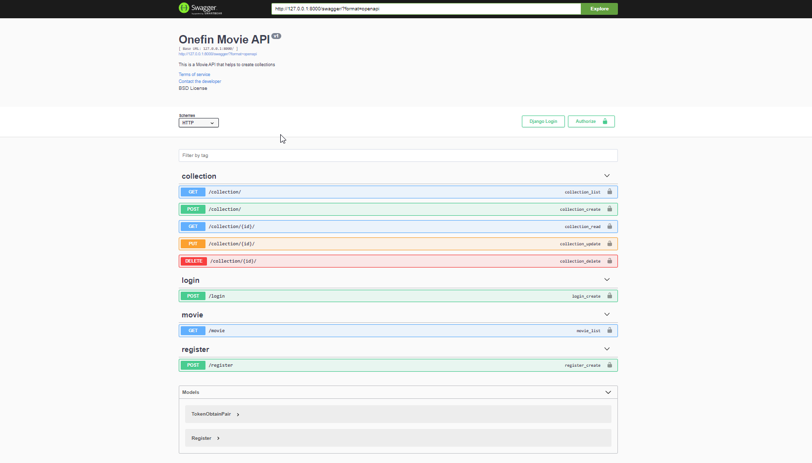
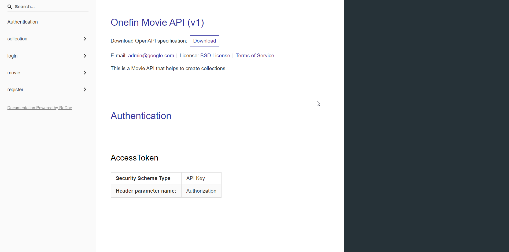

# Backend Assignment Fresher

View Live on  

Swagger : https://onefinalkesh.herokuapp.com/swagger  
Re-doc : https://onefinalkesh.herokuapp.com/redoc/

## Backend Task  
Create Register that generates JWT access token  
Integrate a third party API which serves a list of movies.  
Create Login that generates access token  

Make:  
http://localhost:8000/movies/ that gives pagination   
http://localhost:8000/collection/    
above should allow user to make multiple collection with CRUD   

Using 3rd party API at  : https://demo.credy.in/api/v1/maya/movies/

## Preview Output Result:

# Swagger
  
# Redoc

